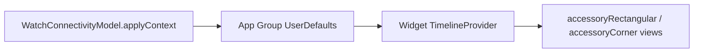

# Watch complications: timers + open app

## Constraints

- Complications run in a **separate process**; they cannot read `[WatchConnectivityModel](ios/TimeTrackerWatch/WatchConnectivityModel.swift)`. You need **shared persistence** the main Watch app writes when state changes.
- There is **no** existing WidgetKit / App Group setup in the repo (`[project.yml](ios/project.yml)` only defines `TimeTracker` + `TimeTrackerWatch`).
- `[StopwatchFormat](ios/Shared/StopwatchFormat.swift)` already provides full `HH:MM:SS`; corner needs a **short** tactical string.

## Architecture

1. **App Group** (example): `group.com.cherished.TimeTracker` — add to **both** `TimeTrackerWatch` and the new widget extension entitlements (`com.apple.security.application-groups`).
2. **Snapshot store** (small helper, lives in **Shared** so app + widget compile it): read/write `mainStart` / `tacticalStart` as optional `TimeInterval` (Unix) in `UserDefaults(suiteName:)`. Same keys as logical meaning; document constants in one place.
3. **Watch app**: At the end of `[applyContext](ios/TimeTrackerWatch/WatchConnectivityModel.swift)` (and anywhere else that mutates these starts if added later), persist the two anchors to the app group. When no session, write `nil` / remove keys so complications show a neutral placeholder.
4. **Widget extension target** (watchOS): New source folder e.g. `[ios/TimeTrackerWatchWidgets/](ios/TimeTrackerWatchWidgets/)` with:
  - `@main` `WidgetBundle` containing **two** `Widget`s (or one widget with two families — two widgets is clearer for different layouts).
  - **Family A — “middle large”**: `supportedFamilies: [.accessoryRectangular]` — `HStack`: **main** stopper on the **leading** side, **larger** / `.primary` weight, **white**; **tactical** string on the **trailing** side, **smaller** font, **pink** foreground (`.primary` in dark complication context is fine for main; use explicit white if you want it always light on tinted backgrounds).
  - **Family B — corner**: `supportedFamilies: [.accessoryCorner]` — single line **tactical only**, pink, **compact MM:SS**:
    - Add `StopwatchFormat.mmssCompact(totalSeconds:)` in Shared: interpret “no hours / ~4 digit feel” as `**%02d:%02d`** with `minutes = (totalSeconds / 60) % 100`, `seconds = totalSeconds % 60` so the string stays short (wraps at 100 hours of minutes is acceptable for a corner slot; document briefly in code).
  - **Open app on tap**: attach `**.widgetURL(...)`** on the widget entry view (or container). Register a **URL scheme** on the Watch app (e.g. `timetracker://`) via `INFOPLIST_KEY_CFBundleURLTypes` / generated Info.plist keys so the system can open the host app reliably (verify on device/simulator).
5. **Timeline**: Implement a `TimelineProvider` that reads the snapshot, then builds entries for the **next ~60 seconds** (one entry per second) with elapsed strings computed **as of `entry.date`**, `reloadPolicy: .after(lastEntry.date)` so the stopwatch **ticks** without requiring constant push updates. When both starts are missing, emit a single static entry with placeholders (`--:--` / `00:00:00` — your choice, keep consistent).
6. **Project wiring**: Extend `[ios/project.yml](ios/project.yml)` with a new watchOS **app extension** target (WidgetKit), `sources` including the new widget folder **and** `Shared` (for `StopwatchFormat` + snapshot helper). Embed that extension in `**TimeTrackerWatch`** (`dependencies` + `embed: true`). Run `**xcodegen generate`** from `ios/` so `[project.pbxproj](ios/TimeTracker.xcodeproj/project.pbxproj)` stays the single generated artifact (avoid hand-editing pbxproj if you use XcodeGen in this repo).
7. **Pink color**: Widget views can use a small `Color` constant (e.g. HSL pink) next to existing `[AppTheme](ios/Shared/AppTheme.swift)` or a `static let complicationTactical` in the widget file — keep it **readable on watch** (sufficient contrast on complication backgrounds).

## Files to add / touch (expected)

| Area                             | Action                                                                                                            |
| -------------------------------- | ----------------------------------------------------------------------------------------------------------------- |
| Shared                           | `TimerSnapshotStorage.swift` (or similar) + `StopwatchFormat.mmssCompact`                                         |
| Watch app                        | Call storage from `WatchConnectivityModel.applyContext`; entitlements + URL scheme                                |
| New                              | `TimeTrackerWatchWidgets/*.swift` (bundle + 2 widgets + provider)                                                 |
| New                              | `TimeTrackerWatch.entitlements`, `TimeTrackerWatchWidgets.entitlements` (or generated via yml `entitlements` key) |
| `[project.yml](ios/project.yml)` | New target + embed + extension Info.plist keys for WidgetKit                                                      |

## Verification

- `xcodegen generate` then build **TimeTrackerWatch** scheme (includes embedded widget).
- Simulator or device: add **Rectangular** and **Corner** complications, confirm ticking, colors/layout, and tap opens app.

## Risks / notes

- First-time **App Group** setup requires the same group ID in Apple Developer portal for signing (Debug may still run locally with automatic signing).
- Very long sessions: rectangular uses full `StopwatchFormat.hms`; corner uses compact MM:SS with minute wrap as above.

