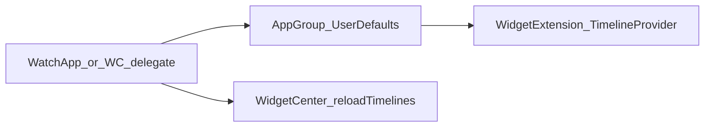

# watchOS complications that stay in sync

## Architecture

- **Widget extension** runs in a **separate process**. It cannot read your app’s in-memory `ObservableObject`. Use **shared persistence** (typically **App Group** `UserDefaults`) that the **watch app** writes whenever state changes.
- After every snapshot write, call **`WidgetCenter.shared.reloadTimelines(ofKind:)`** for **each** widget `kind` string (or reload all). Otherwise the complication keeps serving an old timeline until the next scheduled reload.

## App Group and XcodeGen

- Declare the group in **`entitlements.properties`** inside [`project.yml`](ios/project.yml) for **every** target that needs it (iOS app, watch app, widget). Plain `entitlements.path` **without** `properties` can be overwritten by `xcodegen generate` into **empty** plists.
- Keep **`DEVELOPMENT_TEAM`** in **xcconfig** (e.g. `Base.xcconfig`), not only in the generated `pbxproj`.

## WatchConnectivity merge rules

- If the phone omits keys for optional fields (e.g. no `mainStart` when idle), the watch must set those fields to **`nil`**, not leave previous values. **Guard updates**: only apply timer anchors when the payload is a **real snapshot** (e.g. includes `stateTitle`), so an empty `replyHandler([:])` does not wipe state.
- **`snapshotForWatch()`** should always include a **stable marker** key (e.g. current title) when sending full state.

## Ticking stopwatches on the face

- **Dense per-second `TimelineEntry` lists** are often **coalesced** on watchOS; the face may freeze after a few seconds.
- **`TimelineView(.periodic)`** inside accessory complications is **not reliable** for per-second redraws.
- Prefer **`Text(timerInterval: ClosedRange, pauseTime: nil, countsDown: false)`** with a long upper bound for **count-up** elapsed time, plus a **single** timeline entry and a **long** `TimelineReloadPolicy.after(...)` as a safety net.

## New complication / new `kind`

1. Add a **`static let`** in a shared enum (e.g. `WatchComplicationKind`) and include it in the **reload loop**.
2. New **`Widget`** in the same extension bundle; **`@main` `WidgetBundle`** lists all widgets.
3. If the UI needs new data, **extend the App Group snapshot** and persist from the same place that already runs after WC/context updates.

## Verification checklist

- Change state on **iPhone**; complication updates after watch has received context (often requires watch app or session delivery at least once).
- **Build** the iOS scheme that embeds the watch app + widget.
- On device: add complication, background the app, confirm timers/text refresh when expected.
